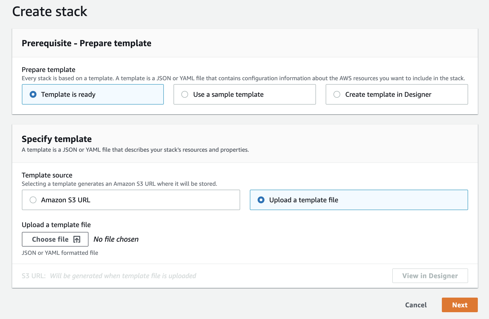

# Prerequisite
We prepare a CloudFormation template that will build an [RStudio Server](https://rstudio.com/products/rstudio/download-server/) on a EC2 instance with all the necessary permission and networking for your convenience. You can spin up all the necessary resource to run an RStudio Server. The template is design to work with the following regions: us-east-1, us-east-2, us-west-2, and eu-west-1. Please follow the [link](https://us-west-2.console.aws.amazon.com/cloudformation/home?region=us-west-2#/stacks/create/template) to create a new stack in CloudFormation console. Note that the region is currently set as us-west-2, please switch to your region if needed. Choose **Upload a template file**, **Choose file**, select the [ec2_ubuntu_rstudio_sagemaker.yaml](../cloudformation/ec2_ubuntu_rstudio_sagemaker.yaml) from the repository, and hit **Next**.

In Step 2 **Specify stack details**, you will be prompted to enter a **Stack name** and an **EC2 key pair**. Pick any name and select a key pair in your account for accessing the EC2 instance. Please review and accept the [AGPL v3 license](http://www.gnu.org/licenses/agpl-3.0-standalone.html) for RStudio installation. Then hit **Next**. 

In Step 3 **Configure stack options** page, we will bypass any options and keep default values, hit **Next**.

In Step 4 **Review**, please acknowledge and hit **Create Stack**. The stack creation will take about 15 to 20 minutes to get all resources up and running.

Once the stack creation completes, go to **Output** tab to find the RStudio IDE login URL: `ec2-xx-xxx-xxx-xxx.us-west-2.compute.amazonaws.com:8787`. Open the URL in your favorite browser. 

Login the RStudio instance with username **ubuntu** and password **rstudio**. 

